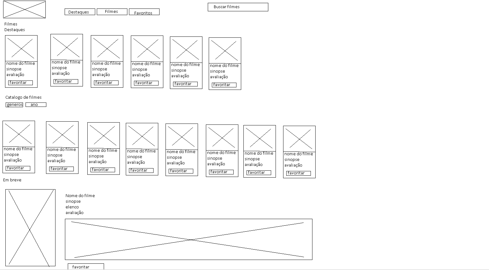
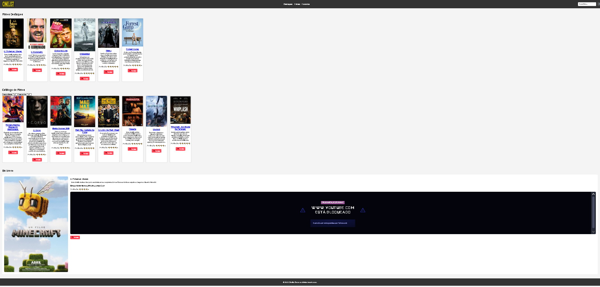

# Trabalho Prático - Semana 03

Dessa vez, vamos escolher uma proposta de projeto para trabalhar. Na [lista de propostas de projetos](propostas-projetos.md), escolha um dentre as alternativas.

Nessa atividade, você deverá montar a página inicial do projeto escolhido, a organização do HTML aplicando semântica correta e uso aprimorado do CSS. Leia o enunciado completo no Canvas para mais detalhes.

**IMPORTANTE:** Você deve trabalhar e alterar apenas arquivos dentro da pasta **`public`**. Deixe todos os demais arquivos e pastas desse repositório inalterados. **PRESTE MUITA ATENÇÃO NISSO.**

## Informações Gerais

- Nome: Davi Araujo Dias
- Matricula: 1112700
- Proposta de projeto escolhida: Catalogo de Filmes 
- Breve descrição sobre seu projeto:sera um site onde as pessoas entrariam para ver indicações de filmes, cada filmes teria sua sinopse e avaliação onde as pessoas conseguiram ver as indicações sobre o filme escolhido.

## Print do esboço criada

<<  COLOQUE A IMAGEM AQUI >>

## Print da home-page criada

<<  COLOQUE A IMAGEM AQUI >>
